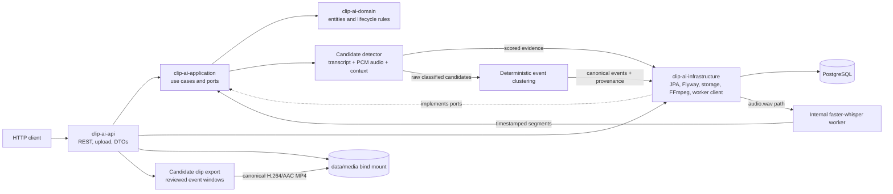

# Clip AI V0.3B.1 Event & Clip Review Studio

Clip AI V0.3C.8 is a Java 21, Spring Boot modular monolith for registering VOD metadata, processing **user-uploaded local video files** through audio extraction and timestamped transcription, finding explainable football-event candidates, reconstructing and canonicalizing event sequences, and exporting reviewed event windows as MP4 clips. The Event & Clip Review Studio makes detector results, match context, independent observations, score contributions, boundaries, and generated clips inspectable. V0.3C.6 attenuates generic audio-intensity/crowd evidence in candidate scoring while retaining the existing transcript/audio-led discovery and conservative replay-association safeguards. V0.3C.8 adds append-only, run-scoped detection persistence and a read-only comparison workflow; reruns preserve prior candidates, observations, review state, clips, transcripts, and source media. Replay cues do not suppress a possible goal by themselves: a replay is associated with an established live goal only when explicit replay context, repeated same-action evidence, and the absence of a new score transition support that match. Unmatched candidates are retained for review. Goal clip boundaries are reconstructed from connected local buildup/action evidence, independent pre-event audio transitions, immediate reaction, replay-introduction cues, and restart signals; canonical events preserve source-candidate IDs, merge reasons, and grouped evidence in PostgreSQL. The API stores uploads locally, schedules transcription asynchronously, extracts mono 16 kHz PCM WAV audio with FFmpeg, sends it to an internal faster-whisper worker, and persists transcript segments.

## Scope

V0.2 adds one local upload-to-transcript path while retaining the V0.1 metadata API. V0.3A adds football candidate detection after transcription. V0.3C.8 makes each manual detection run append-only and inspectable rather than replacing prior results. V0.3A.1 adds multi-signal live-versus-replay discrimination, explainable audio/context evidence, and bounded event boundaries. V0.3B adds reviewed candidate clip export. V0.3A.3 adds deterministic event clustering, contextual goal-kick handling, corroborated goal discovery, and separated goal-review frame storage. V0.3A.4 adds reconstruction from earlier action cues, replay-to-live association, and context-supported foul/event sequencing. V0.3A.5 adds an explainable audio-led goal hypothesis for transcript-missed goals. V0.3A.6 adds restart-aware goal boundaries and replay evidence. V0.3A.6.2 restores recall by separating goal-candidate discovery from replay association, retaining shot-plus-reaction hypotheses without requiring a score transition, and preventing generic similarity or replay context alone from merging or rejecting goals. V0.3A.6.3 keeps audio-led discovery recall-oriented while requiring independent confirmation before an inferred shot/excitement hypothesis is accepted as a canonical live goal; unconfirmed hypotheses and their evidence remain persisted as rejected review candidates. V0.3A.7 improves GOAL clip-boundary reconstruction and preserves the 30-second fallback. V0.3A.8 refines only GOAL start selection: connected semantic buildup is fenced by replay/restart/context boundaries; an isolated generic attack does not displace fallback, while a shot, explicit penalty setup wording, a connected attack sequence, or a multi-feature audio transition can provide a better start. A lone pitch/voice excitement signal is insufficient. The 30-second fallback, immediate-reaction end behavior, and 60-second cap remain; goal discovery and classification semantics are unchanged. Metadata registration still only records metadata; it does not download the referenced VOD. The upload endpoint accepts video files supplied by the caller and does not fetch remote URLs.

This release does **not** include a platform-specific downloader, live streams, Qwen/LLM analysis, computer vision, automatic highlight selection, general video editing, publishing, authentication, or distributed infrastructure. Candidate scoring uses configurable lexical and relative audio/context signals; it does not understand video or prove that an event happened. Review candidates before exporting; candidates automatically rejected by detection require explicit human confirmation before individual clip export. FFmpeg extracts audio and re-encodes selected windows as H.264/AAC MP4s. Uploads, extracted WAV files, and exported clips are retained in local storage; batch-generation job state is in memory and is lost if the API restarts.

## Technology

- Java 21; Spring Boot 3.5.6; Maven multi-module build
- PostgreSQL 16 and additive Flyway migrations
- Spring Web, Spring Data JPA, JDBC, Bean Validation, Actuator, and Springdoc OpenAPI 2.8.13
- Docker Compose v2; API image includes FFmpeg; internal Python 3.12/FastAPI worker uses faster-whisper 1.1.1
- Testcontainers PostgreSQL for database-backed HTTP integration tests; no Lombok

## Architecture



The API is the composition and HTTP layer. Application use cases depend on domain types and ports; infrastructure implements the ports. The domain module has no Spring, JPA, FFmpeg, Python, or platform-specific dependencies. Processing runs on a bounded asynchronous executor and does not hold a database transaction while FFmpeg or the worker runs.

| Module | Responsibility |
|---|---|
| `clip-ai-domain` | Framework-free media, transcript, candidate/evidence types, validation, and lifecycle transitions |
| `clip-ai-application` | Use cases, repository contracts, upload validation, processing orchestration, explainable signal detection/scoring, and ports |
| `clip-ai-infrastructure` | JPA entities/adapters, Flyway SQL, local storage, safe FFmpeg execution, PCM WAV feature analysis, and transcription HTTP client |
| `clip-ai-api` | Spring Boot entry point, REST DTOs/controllers, validation/errors, OpenAPI, async configuration, and runtime configuration |
| `ai-worker` | Internal FastAPI service that validates shared-storage paths and runs faster-whisper |

`MediaSource`/`MediaDownloader` remain acquisition extension points only. `MediaProcessor`/`AudioExtractor` and `TranscriptionService` have V0.2 local implementations behind application ports.

## Processing flow

1. `POST /api/media-assets/upload` validates a non-empty supported video upload, stores it under `media/<mediaAssetId>/source.<extension>`, persists the media asset as `STORED`, and returns `202 Accepted`.
2. A bounded background executor transitions the asset to `PROCESSING` and invokes FFmpeg. Extracted audio is stored beside the source as `audio.wav` (mono, 16 kHz, signed 16-bit PCM).
3. The asset transitions to `TRANSCRIBING`; a pending transcript is persisted and the API calls the internal worker with the shared-volume audio path.
4. Returned segments are sorted by timestamp, assigned stable sequence numbers, and persisted with millisecond offsets. The transcript and asset become `COMPLETED`.
5. Failures transition the asset and any existing nonterminal transcript to `FAILED` with a public-safe reason. Diagnostic exceptions are logged server-side.
6. On successful transcription, the bounded executor schedules candidate detection. It matches configurable football phrases in English, Portuguese, Spanish, French, Italian, and German transcripts; identifies emphasis, repetition, speech-rate increases, buildup, replay, and retrospective language; and compares PCM WAV RMS/peak windows to a local median baseline. The single-pass WAV analysis also estimates voiced pitch/F0, pitch variation, and a cautious broadband crowd-reaction proxy.
7. Typed transcript event signals create raw classified candidates at exact anchor times. Goal-kick expressions are typed as non-scoring restart context rather than GOAL evidence; a bare “goal” is weak, while explicit scoring phrases and celebratory calls are stronger. Existing confidence thresholds are unchanged. Goal discovery supports ordered buildup/shot/reaction cues and also a supported shot with independent voice/audio reaction and speech-rate increase without requiring a score transition. A later score transition is strong corroboration, not a prerequisite. Explicit replay or retrospective cues do not filter candidates at discovery time; save/miss outcomes and goal-kick context remain useful counter-evidence. Elongated goal calls such as “GOOOOOOL” are recognized as strong lexical evidence. Correlated audio excitement, pitch, speech-rate, and energy are not treated as independent votes.
8. A deterministic event-clustering pass runs after classification and before persistence. It compares same-type events using event-specific trigger proximity and transcript/event evidence, not time distance alone. For goals, an earlier shot/action cue can be recorded as the action time even when scoring commentary is the later trigger; only a shared reconstructed action permits goal-detection merging. A rejected goal is associated as replay support only when an established detected live goal precedes it, explicit replay/retrospective context is present, specific same-action transcript evidence is shared, and no new score transition supports a live event. Similar audio, generic goal language, temporal nearness, injury context, or broad transcript overlap alone cannot reject or merge a goal; ambiguous candidates remain available for review. Replay support is recorded in source candidate IDs and association evidence, but it does not widen the live clip window. The best-supported detected member supplies the canonical ID/score/trigger; canonical boundaries remain capped at 60 seconds. Foul-to-penalty and foul-to-card sequence evidence is attached only when the foul precedes the event and nearby transcript context overlaps. Batch and individual clip export consume only persisted canonical `DETECTED` events, so one canonical goal produces one clip. Only the selected representative's exact persisted `startTimeMs` and `endTimeMs` are cut; goal pre-roll is not added again. Non-goal padding defaults to 5 seconds before and 8 seconds after; the 30-second goal fallback remains, and reconstructed action/buildup windows remain subject to the 60-second cap.
9. MP4 clips are stored under `media/<mediaAssetId>/clips/goals`, `cards`, `shots`, or `other` for remaining event types. Pre-goal JPEG review frames remain available through the existing API but now live under `media/<mediaAssetId>/analysis/goal-review/<candidateId>/frames`; the detector does not consume them. New JPEGs are never written into `clips/`. Existing legacy frames remain untouched and are still readable. Transcript-cued replay clips remain MP4s under the goal review subtree. Existing candidate MP4s are reused.

The first worker request lazily loads the configured model; the worker health check is a liveness check and does not preload the model. CPU mode is the default. Supported upload filename extensions are `.mp4`, `.mkv`, `.webm`, `.mov`, and `.avi`; the MIME type is not trusted. The original filename is sanitized and is not used as a storage path.

## V0.3C.8 safe detection runs

Each detection request creates a persisted run with a UUID, detector version, configuration hash, lifecycle status, and result counts. Candidate and observation results are appended with that run ID; completed-result persistence and the asset's detection status update are transactional. A partial unique database index prevents concurrent active runs for one media asset. A failed or repeated run does not delete or rewrite earlier candidates, observations, review records, generated clips, transcripts, or source files.

Rows created before run tracking retain a null run ID. The API presents them as a read-only `legacy` baseline without inventing a historical run record or detector configuration. Use the run-specific candidate/observation routes to inspect isolated evidence and the comparison route to match events across runs. Candidate matching is deterministic and one-to-one, preferring event-type agreement within 15 seconds and otherwise requiring sufficient transcript-context similarity. Optional time-centered comparison groups run observations by evidence family. The Detection Runs panel in the match workspace provides run selection, inspection, comparison, and safe run creation.

## V0.3A.4 event reconstruction

Candidate trigger time and reconstructed action time are separate pieces of evidence. A GOAL candidate may use a preceding transcript shot cue as its action anchor when that cue is within the configured buildup/search window and no intervening goal anchor indicates a different scoring event. The clip begins before that action, while the later scoring-commentary trigger and post-event reaction remain inside the window. If no defensible action cue exists, the existing 30-second goal fallback remains. The final window remains capped at 60 seconds; the detector does not add pre-roll again during MP4 export.

Clustering can merge differently timed GOAL candidates when they point to the same reconstructed action. A later rejected GOAL with explicit replay context is associated to an earlier detected GOAL using available context, phrase anchors, score state, injury-to-replay evidence, and event ordering; association is not restricted to the replay time window. The canonical live clip boundaries are never extended to include the replay; replay candidate IDs and `EVENT_ASSOCIATION` evidence preserve the relationship. An unmatched replay candidate stays separate for review; if evidence is insufficient to associate it confidently, recall-first logic retains it rather than labeling it as a replay of another event.

For PENALTY and card events, a preceding FOUL cue may anchor the event window only when it is within 15 seconds and the local transcript contexts share evidence. The association is retained as an `EVENT_ASSOCIATION` signal; it does not itself create or promote an event. Retrospective score reports are not treated as live score changes after the candidate trigger. These are transcript/audio hypotheses and do not replace visual review or establish ground-truth precision or recall.

## V0.3A.5 audio-led goal discovery

The Elche–Barcelona miss was traced to a real transcript error rather than audio extraction drift. Around 54:17 (approximately 3,257,000 ms), the transcript contained a noisy player/action phrase and later commentary reporting the score as 0–2, but no reliable “goal” call. The source MP4 and extracted WAV durations differed by about 4 ms. The production PCM analyzer already measured a sustained voice-excitement response beginning near 3,256,500 ms, including strong pitch rise/variation and voiced-excitement confidence. However, the old discovery path started from transcript shot cues, and the score parser did not represent score changes as event evidence; the later generic ATTACK candidate was consequently rejected instead of becoming a GOAL.

V0.3A.5 introduced an audio-led hypothesis for transcript-missed goals using voiced excitement, nearby football action, and score-state evidence. V0.3A.6.2 retains this path while treating score transitions as strong corroboration rather than an absolute prerequisite for a supported shot with independent voice/audio reaction and increased speech rate. Replay context is resolved in a later association stage; it no longer prevents discovery of the candidate. New evidence uses the existing persisted signal format, so no database migration is required. The boundary assembler keeps the existing maximum duration and fallback goal pre-roll; clip export still consumes only the persisted boundaries and adds no second pre-roll.

The transcript-missed-goal path does not improve or replace Whisper, use video frames, or claim event certainty. Existing ASR output and timestamps remain unchanged; audio-led candidates remain explainable hypotheses for manual review.

## V0.3A.6 canonical goals, replays, and restart boundaries

The existing transcript-led and V0.3A.5 audio-led discovery paths remain in place. Context extraction records explicit replay, retrospective commentary, player injury/medical attention, and match-restart cues. Replay audio may contain strong “GOOOL”, excitement, pitch rise, or action language, so replay classification is separate from candidate discovery and live-goal acceptance.

## V0.3A.6.2 recall-first goal association

Discovery and replay association are separate stages. A supported shot with voice/audio reaction and speech-rate evidence can create a goal hypothesis without a score-state transition; an explicit scoring phrase can also qualify under the existing thresholds. Score changes remain strong corroboration, but replay commentary does not create a new score transition. A replay cue alone, generic excitement, temporal similarity, shared broad vocabulary, or injury followed by a replay never suppresses a possible goal.

A replay can be associated with a canonical goal only after an earlier goal is already detected, the candidate contains explicit replay/retrospective context, the transcript context shares multiple specific same-action tokens, and no new score transition supports a live goal. This rule permits replay association far from the original event without relying on match/candidate IDs or timestamps. Association/rejection evidence records `REPLAY_OF_EXISTING_GOAL`, `DUPLICATE_EVENT`, `NO_NEW_SCORE_TRANSITION`, `REPLAY_CONTEXT`, and `INJURY_THEN_REPLAY` where applicable. If the evidence is ambiguous, the candidate is retained rather than silently merged. Distinct goals remain separate even when their audio or generic commentary is similar. Overlapping detector outputs for one scoring action can also merge when they share the reconstructed action, or the exact same score-transition timestamp and outcome together with strongly overlapping transcript context; different score transitions prevent that merge.

For GOAL boundaries, the earliest detected match restart after the event is a hard clip end, even if later transcript/audio reaction signals would otherwise extend the afterglow. Boundary evidence includes `POST_RESTART`. Restart evidence includes localized kickoff/resumption wording and post-goal midfield-play commentary as a resumption proxy. The existing 60-second maximum and stored goal pre-roll are preserved; MP4 export still uses the persisted start/end timestamps without applying another pre-roll. The evidence is transcript-derived and can miss noisy or unrecognized restart wording; outputs remain for manual review and are not visual verification.

## V0.3A.6.3 goal confirmation and counter-evidence

Candidate discovery remains audio/transcript-led and still emits plausible shot-plus-reaction GOAL hypotheses without requiring score commentary. Acceptance is a separate step: an inferred hypothesis is not a canonical detected goal based only on excitement, a shot, and speech-rate increase. It needs independent confirmation from explicit scoring language, a score-state transition, an established replay-to-live reconstruction, a nearby penalty attempt paired with a shot and independent live reaction, or ordered attack-buildup/shot evidence with textual reaction. This preserves low-transcript-quality goals, including a corroborated penalty, without treating every excited shot as a score.

The assembler keeps unconfirmed hypotheses and their original signals as rejected candidates with `GOAL_HYPOTHESIS_UNCONFIRMED`, rather than deleting discovery evidence. Nearby retrospective goal references, corner/set-piece shots without scoring confirmation, and shot evidence followed by continued attack are separately explained as `RETROSPECTIVE_GOAL_REFERENCE`, `SET_PIECE_SHOT_WITHOUT_SCORING_CONFIRMATION`, and `NON_SCORING_SHOT_CONTINUED_PLAY`. Explicit scoring and score-transition evidence takes precedence over retrospective wording. These checks do not change replay association, score-transition parsing, candidate discovery thresholds, or the 60-second clip limit.

## V0.3A.8 GOAL build-up start reconstruction

GOAL clip boundaries are estimated separately from candidate discovery and classification. Starting from the reconstructed live action timestamp when available (otherwise the event trigger), the assembler searches backward within the configured boundary-search and buildup-lead windows for a connected semantic attack/shot sequence, an explicit penalty setup, or supported acoustic buildup. A phrase-level attack cue can connect to the action within the configured buildup lead; generic attack events must be close to the action or connect to a detected shot. Multi-cue semantic sequences only extend to an earlier cue when transcript timing provides a continuous bridge; replay, retrospective, injury, restart, unrelated-action, and goal-kick context fences off evidence from an earlier phase of play. Acoustic buildup requires a temporally coherent cluster across at least two independent feature families (RMS energy, speech rate, or pitch); a single local RMS energy-rise remains usable as a specific transition, while a lone pitch/voice-excitement cue does not override fallback. Explicit penalty-attempt wording can anchor a boundary even when the transcript classifier did not emit a typed penalty signal. If there is no reliable live buildup/action cue, the existing configurable 30-second goal pre-roll remains the fallback.

The end includes available immediate reaction and configured post-event padding. Reaction evidence is searched for up to 20 seconds after the live action; a detected restart within 30 seconds or a replay/post-event commentary boundary can stop the clip sooner. This V0.3A.8 change does not alter end-boundary selection, maximum-duration enforcement, or clip export. The persisted boundary evidence is explainable: `EVENT_BOUNDARY` records a start reason such as `START=CONNECTED_ATTACK`, `START=AUDIO_BUILDUP`, `START=ATTACK_INTENSITY_RISE`, `START=PENALTY_SETUP`, `START=DECISIVE_ACTION`, or `START=FALLBACK_PRE_ROLL`; `EVENT_AFTERGLOW` records an end reason such as `END=GOAL_REACTION`, `END=IMMEDIATE_RESTART`, `END=REPLAY_BOUNDARY`, or `END=FALLBACK_POST_WINDOW`. The existing configured maximum duration remains enforced deterministically, prioritizing the action and immediate reaction. Boundaries are clamped to media duration, and export consumes the stored window without adding another pre-roll. These transcript/audio signals can be incomplete; clips remain subject to manual review.

When multiple detections of the same reconstructed GOAL are canonicalized, a supported buildup start is preferred over fallback pre-roll, the representative detection's immediate-reaction end is retained, and a detected restart/replay stop takes precedence over that end. Canonicalization therefore does not widen a live goal clip merely by taking the earliest start and latest end from every overlapping detection. Non-goal event-window merging is unchanged.

## Local media storage (Docker Compose)

The default CPU Compose setup and optional GPU override both bind the project directory `./data/media` to `/var/lib/clipai/media` inside the API and transcription-worker containers. On this Windows checkout, files are visible under `C:\SideProjects\ClipAI\data\media\`; for example, clips are written to `data\media\media\<mediaAssetId>\clips\goals`, `cards`, `shots`, or `other`. Original uploads and extracted WAV audio are stored in the same tree; transcript text and segments remain in PostgreSQL.

From the project root in PowerShell, create the host directory before starting Compose:

```powershell
New-Item -ItemType Directory -Force .\data\media | Out-Null
docker compose up --build -d
```

`data/media/` is intentionally gitignored because it contains local originals and generated media. Deleting it removes those local files but does not remove the corresponding database records. Changing the Compose mount does not migrate files from a previous Docker named volume; copy any volume contents you want to keep before retiring that volume.

## Data model and database

- **MediaAsset**: UUID, source label, nullable HTTP(S) source URL (null for uploads), optional external ID, title, content type, optional duration in milliseconds, optional local storage key, media status, independent candidate-detection status/failure reason, optional media failure reason, and UTC creation/update timestamps.
- **Transcript**: UUID, unique required reference to one media asset, language, status, optional failure reason, and timestamps. The schema enforces the one-to-one relationship.
- **TranscriptSegment**: UUID, transcript reference, sequence, start/end milliseconds, and text. Checks require nonnegative sequence/start and end greater than start; sequence is unique per transcript.
- **CandidateEvent**: canonical UUID, media-asset reference, estimated start/end and trigger timestamps in milliseconds, event type, normalized 0–1 score, JSONB array of typed evidence signals, optional transcript context, status, creation time, source candidate UUIDs, and optional merge reason. Live/replay probabilities and rejection reasons are derived from persisted signals. V6 adds provenance with a foreign-key relationship retained through the canonical ID; the schema also enforces timestamp, score, event type, evidence, provenance, and asset constraints.
- **Exported clips and goal review assets**: final event MP4 files use the canonical candidate UUID under `clips/goals`, `clips/cards`, `clips/shots`, or `clips/other` for remaining event types. Goal review frames are stored separately under `analysis/goal-review/<candidateId>/frames`; the existing frame-download API remains available. Transcript-cued replay clips remain MP4 files under `clips/goals/<candidateId>/replays`. No extra database record is needed.
- **CandidateSignal** evidence records the signal type, optional event hypothesis, confidence, timestamp, and short explanation (for example, a configured phrase match, relative dB energy, pitch change, replay cue, estimated boundary, reconstructed action, or supported event association).
- Content types are `GENERIC`, `GAMING`, `IRL`, `PODCAST`, `INTERVIEW`, `SPORTS`, `POLITICAL_SPEECH`, `NEWS`, and `EDUCATIONAL`.
- Media statuses retain V0.1 values `PENDING`, `DOWNLOADING`, `READY`, `PROCESSING`, `COMPLETED`, and `FAILED`, and add `STORED` and `TRANSCRIBING` for local upload processing. Transcript statuses are `PENDING`, `PROCESSING`, `COMPLETED`, and `FAILED`.
- Candidate detection statuses are `NOT_STARTED`, `PROCESSING`, `COMPLETED`, and `FAILED`; candidate event statuses are `DETECTED`, `AI_ANALYZED`, and `REJECTED`. A rejected hypothesis is excluded from batch export; a reviewer may explicitly confirm it for individual export without changing its automatic status. `AI_ANALYZED` remains a reserved extension point.
- Upload processing follows `STORED -> PROCESSING -> TRANSCRIBING -> COMPLETED`; any active state may fail. Metadata-only registration retains its V0.1 lifecycle.
- Flyway migrations are in `clip-ai-infrastructure/src/main/resources/db/migration/`: `V1__create_media_assets.sql` through additive `V7__create_candidate_reviews.sql`. V5 adds detection state and persisted candidate events. V6 adds source-candidate IDs, merge reasons, and an event lookup index while backfilling existing candidates as their own source. V7 stores review state and optional manual boundaries per candidate. Existing migrations are not edited. Hibernate runs in `validate` mode; Flyway owns schema changes.

## HTTP API

| Method and path | Behavior |
|---|---|
| `POST /api/media-assets` | Register metadata only; JSON includes `source`, `sourceUrl`, `title`, and `contentType`; returns `201 Created` |
| `POST /api/media-assets/upload` | Multipart field `file` is required; optional fields are `title`, `contentType`, and `source`; returns `202 Accepted` while processing continues |
| `GET /api/media-assets?page=0&size=20&status=STORED` | Paginated listing; status is optional; page is zero-based and size is 1–100 |
| `GET /api/media-assets/{id}` | Retrieve media metadata, current status/failure reason, and transcript summary when available |
| `GET /api/media-assets/{id}/transcript` | Retrieve transcript status, language, and timestamped segments; returns `404` until a transcript exists |
| `GET /api/media-assets/{id}/source` | Stream locally stored source video for the review player, including byte-range seeking; storage paths are not exposed |
| `POST /api/media-assets/{id}/candidates/detect` | Schedule or re-run detection for a completed asset with a completed transcript; returns `202 Accepted`, or `409` if not ready/already processing |
| `POST /api/media-assets/{id}/detection-runs` | Start an append-only detection run; returns `202 Accepted` with its run ID and status |
| `GET /api/media-assets/{id}/detection-runs` | List persisted runs plus a read-only `legacy` baseline when older candidates/observations exist |
| `GET /api/media-assets/{id}/detection-runs/{runId}` | Retrieve run lifecycle, detector/configuration identifiers, and result counters |
| `GET /api/media-assets/{id}/detection-runs/{runId}/candidates` | List only candidates created by that run (or the `legacy` baseline) |
| `GET /api/media-assets/{id}/detection-runs/{runId}/observations?startTimeMs=0&endTimeMs=60000&limit=500` | List run-scoped observations in a bounded time range |
| `GET /api/media-assets/{id}/detection-runs/compare?leftRunId=legacy&rightRunId={runId}` | Compare matched, changed, and run-only candidates; optional `centerTimestampMs` and `windowMs` include grouped observations |
| `GET /api/media-assets/{id}/candidates?sort=score` | List classified candidate/event rows in descending score order; `sort=timestamp` orders by start time. Includes source candidate IDs and merge reason for canonical events. |
| `GET /api/media-assets/{id}/candidates/{candidateId}` | Retrieve one candidate/event and its evidence, source IDs, and merge explanation; IDs are scoped to their media asset |
| `GET /api/media-assets/{id}/candidates/{candidateId}/review` | Retrieve automatic and effective boundaries, human review status, maximum clip duration, and whether a clip exists |
| `PUT /api/media-assets/{id}/candidates/{candidateId}/review` | Set review status (`UNREVIEWED`, `CONFIRMED`, `REJECTED`) and optionally save a validated manual clip window; automatic detection status/boundaries are retained |
| `POST /api/media-assets/{id}/candidates/clips` | Queue MP4 generation for all `DETECTED` candidates; reviewer-rejected candidates are excluded, remaining event types use the `other` folder, and existing clips are reused. Returns `202 Accepted`. |
| `GET /api/media-assets/{id}/candidates/clips` | Get the latest batch's overall and per-candidate generation statuses, timestamps, storage keys, and download URLs |
| `POST /api/media-assets/{id}/candidates/{candidateId}/clip` | Export a detected or explicitly human-confirmed candidate using its effective boundaries; `?regenerate=true` replaces an existing clip. Goal exports also return separate analysis-frame and detected-replay links and source provenance. |
| `GET /api/media-assets/{id}/candidates/{candidateId}/clip` | Download the exported MP4; add `?inline=true` for byte-range playback in a browser |
| `GET /api/media-assets/{id}/candidates/{candidateId}/clip/review-assets` | List saved goal build-up frames and transcript-cued replay clips |
| `GET /api/media-assets/{id}/candidates/{candidateId}/clip/frames/{frameNumber}` | Download one sampled pre-goal JPEG still from the separate `analysis/goal-review` tree |
| `GET /api/media-assets/{id}/candidates/{candidateId}/clip/replays/{replayNumber}` | Download one transcript-cued replay MP4 |
| `GET /api/clips` | List generated clips with media/event metadata and inline playback/download links; no filesystem paths |
| `GET /actuator/health` | Application health |
| `GET /api-docs` | OpenAPI JSON |
| `GET /swagger-ui` | Swagger UI |

### Testing a video upload in Swagger

1. Start the local stack with `docker compose up --build -d`, then open `http://localhost:8081/swagger-ui/index.html`.
2. Expand **POST `/api/media-assets/upload`**, choose **Try it out**, and select the MP4 in the required `file` picker. Optional fields can be set to a descriptive title, `SPORTS`, and `LOCAL_UPLOAD`.
3. Choose **Execute**. The endpoint returns `202 Accepted` with the media asset ID; the upload itself completes before that response, while extraction/transcription continue asynchronously.
4. Use **GET `/api/media-assets/{id}`** to poll that ID. When `status` and `transcript.status` are `COMPLETED`, use **GET `/api/media-assets/{id}/transcript`** to view the language and timestamped segments. Candidate detection runs after transcription and has its own status; use **GET `/api/media-assets/{mediaAssetId}/candidates`** to inspect its results.

The default upload limit is 2 GB, sufficient for the supplied approximately 931 MB MP4. The default worker uses the CPU `base` model and auto-detects language. An optional upload language hint may be an ISO language code (for example, `en`) or a full language name (for example, `English`); full names are normalized to a code before calling Whisper. The first transcription downloads the model; a full-length match may take substantially longer than the upload and audio extraction. To prefer French explicitly for subsequent jobs, set `WHISPER_LANGUAGE=fr` before starting the worker; leave it unset to auto-detect. Do not restart the API while a transcription is in progress, since in-process jobs are not durable.

### Reviewing and generating football clips in Swagger

1. Use `GET /api/media-assets/{mediaAssetId}/candidates?sort=timestamp` and inspect each candidate's event type, score, `liveEventProbability`, `replayProbability`, `rejectionReasons`, typed signal evidence, timestamp window, and transcript context. These are hypotheses, not verified events; rejected candidates are available for diagnosis and may be individually exported only after human confirmation.
2. To generate clips asynchronously, call `POST /api/media-assets/{mediaAssetId}/candidates/clips`. Poll `GET` on the same URL until the batch status is `COMPLETED` or `COMPLETED_WITH_FAILURES`. Only candidates marked `DETECTED` are considered; rejected candidates are not included. Goals, cards, and shots use their dedicated folders; other event types go under `other`.
3. Each clip entry returns its candidate ID, event type, score, exact effective `startTimeMs`/`endTimeMs`, duration, generation status (`PENDING`, `GENERATED`, `REUSED`, or `FAILED`), storage key, and download URL. The batch never adds another goal pre-roll or changes automatic timestamps. A saved human boundary override is used for that candidate's export. Individual goal exports still create build-up frames and transcript-cued replay clips.
4. Open a returned `downloadUrl` in Swagger or call it directly to download/watch the MP4. The individual endpoint is `GET /api/media-assets/{mediaAssetId}/candidates/{candidateId}/clip`. Repeating the batch request reuses existing clips. Batch status is in-memory; generated files persist across API restarts.
5. With Docker Compose, clip files are available directly under `data/media/media/<mediaAssetId>/clips/goals`, `cards`, `shots`, or `other` on the host. The containers continue to access the same files through `/var/lib/clipai/media`; when the API runs locally, storage keys are relative to `MEDIA_STORAGE_ROOT`.

### Generating the Brest–Rennes and Elche–Barcelona clips

The supplied matches are already registered and have candidate results. Start generation for both with PowerShell:

```powershell
$base = 'http://localhost:8081'
$mediaAssetIds = @(
  '25ddc7b9-bd04-41d6-abd7-77933fd9f3f5', # Brest–Rennes
  '18f18f15-8353-4d49-b30b-4868df7b7dbe'  # Elche–Barcelona
)

foreach ($id in $mediaAssetIds) {
  Invoke-RestMethod -Method Post -Uri "$base/api/media-assets/$id/candidates/clips" |
    ConvertTo-Json -Depth 8
}
```

For each match, poll `GET http://localhost:8081/api/media-assets/<mediaAssetId>/candidates/clips`. Once complete, download each `GENERATED` or `REUSED` item's `downloadUrl`; alternatively use the per-candidate `GET /api/media-assets/{mediaAssetId}/candidates/{candidateId}/clip` endpoint. In Swagger, expand **POST `/api/media-assets/{mediaAssetId}/candidates/clips`**, execute it with either ID, then poll the matching **GET** operation and open an item's download URL.

Goal imagery is a sampling aid, not visual event recognition: the stills cover the seconds before the detected goal timestamp but are not automatically selected as the assist, shot, or decisive play. Replay discovery currently requires a transcript phrase such as “revoir le but”; silent or poorly transcribed replays may not be found. Review both the goal timestamp and replay assets before treating them as confirmed highlights.

Upload example (Windows PowerShell with `curl.exe`):

```powershell
curl.exe --fail-with-body -X POST `
  -F "file=@C:\videos\episode.mp4" `
  -F "title=Episode 1" `
  -F "contentType=PODCAST" `
  -F "source=LOCAL_UPLOAD" `
  http://localhost:8080/api/media-assets/upload
```

Use the returned `id` to poll `GET /api/media-assets/{id}` until status is `COMPLETED` or `FAILED`, then request `GET /api/media-assets/{id}/transcript`. Processing is asynchronous; the upload response is not a completion result.

Responses use API DTOs rather than persistence entities. Invalid input/enum values return a consistent `400`; oversized uploads return `413`; missing media/transcripts/candidates/clips return `404`; database uniqueness/constraint conflicts, not-ready/already-running detection requests, and incomplete-asset clip requests return `409`; unsupported goal review-asset requests return `422`; candidate-job scheduling failures return `503`; unexpected errors return a generic `500` without stack traces. Processing failures are reported through the status/failure-reason fields. Logs include asset/transcript IDs and timings, not submitted source URLs or transcript content. The API has no authentication; do not expose it to untrusted networks.

### Candidate detection behavior

Detection is deterministic, configurable, and designed to propose review points rather than assert verified events. Transcript-specific event signals remain the ordinary classification anchors; a supported shot plus independent audio/voice reaction and a speech-rate increase can hypothesize a transcript-missed goal without requiring score commentary. A later score transition is strong corroboration, not an absolute requirement. Generic commentary, score mentions, or isolated audio excitement cannot create a detected event. Lexical signals use language-specific football phrase lists in `clip-ai-api/src/main/resources/application.yml`; unknown transcript languages try the available configured dictionaries. French goal matching handles common transcript mojibake before normalization, recognizes explicit scoring/equalization calls and current-scoring commentary after goal references, and avoids treating every standalone `but` mention as a goal. Spanish goal matching requires explicit scoring wording or a corroborated audio-led hypothesis rather than the generic word `gol`, which can refer to historical goals, offside reviews, saves, or general commentary. Elongated calls such as `GOOOOOOL` are recognized as strong lexical goal evidence. Penalty anchors require action/decision wording (awarded, taken, saved, missed, or converted), not a bare mention of the penalty spot/area. Goal references tied to season statistics and score reports are treated as retrospective unless current scoring language or a corroborated score transition is present. Multilingual nearby context detects replay, earlier-action, retrospective, and attack-buildup phrases, including context split across adjacent transcript segments.

The single-pass PCM analyzer calculates RMS and 100 ms peak levels, zero-crossing rate, and a practical autocorrelation F0 estimate from short voiced frames; pitch is omitted when periodicity is insufficient. Local energy excess/rise, pitch rise/variance, transcript emphasis/rate, and a cautious broadband crowd-reaction proxy are emitted as separate signals. The crowd proxy does not identify speakers, fans, or sound sources. These correlated audio indicators contribute at most one local audio-reaction confidence; transcript emphasis and speech-rate spikes have limited supporting weight. Event-specific transcript evidence has the larger scoring weight. Replay/retrospective cues do not lower live confidence or reject a candidate until the cue can be associated with a previously detected goal using specific same-action evidence and no new score transition. If no live GOAL anchor survived discovery, an explicit replay introduction plus a high-confidence scoring phrase may reconstruct a nearby ATTACK anchor only when it also has a speech-rate spike, matching transcript context, no intervening score transition or injury context, and no established same-action goal; replay audio is not reused as live reaction and the replay is recorded as evidence on the reconstructed event rather than emitted as another GOAL. Candidates expose `liveEventProbability` and `replayProbability`; uncertain replay candidates stay available for review.

## V0.3B.1 Event & Clip Review Studio

The Spring Boot API serves a lightweight static review UI from `clip-ai-api/src/main/resources/static`; it does not add a second frontend build system or database. Start the existing stack, then open **http://localhost:8081/** (or the configured `SERVER_PORT`). The Studio lists media assets, detected and rejected candidates, transcript context, source-video playback with event/start/end seeking, structured backend signals and rejection reasons, replay-related evidence, and generated clips. Search and filters use persisted event metadata, including type, automatic status, score range, replay evidence, human review state, and clip presence. `/clips` provides a searchable generated-clip library with media/event filters and event-time sorting.

From an event detail, use **Confirm**, **Reject**, or **Mark unreviewed** without changing the automatic detection status. Manual start/end overrides are stored separately from the event's original reconstructed boundaries. Both values must be supplied together; start must be non-negative, end must be after start, end must not exceed known media duration, and the window may not exceed `CANDIDATE_MAXIMUM_DURATION_MS`. Clearing both values restores the automatic window. A manually confirmed detector-rejected hypothesis can be exported individually; the automatic result remains `REJECTED`. Individual clip generation consumes the effective window, reuses an existing automatic-window clip unless explicitly regenerated, and replaces existing clips when a manual boundary is present. Existing asynchronous batch generation exposes its current per-candidate progress through the API. The review table is added by Flyway V7; earlier migrations are unchanged and no data reset is required.

The UI uses the current asset/candidate/transcript/clip APIs, plus these review APIs: `GET/PUT /api/media-assets/{id}/candidates/{candidateId}/review`, `GET /api/media-assets/{id}/source`, and `GET /api/clips`. Source and inline clip media responses support HTTP byte ranges for seeking. The clip library returns only generated clips. Metadata-only assets without local source files cannot play a source video. Backend evidence is displayed as returned; the UI does not infer missing signals, correct ASR, or change candidate discovery/classification. The application currently has no authentication, consistent with the existing API, and should remain on a trusted local network.

Raw transcript event anchors remain independent through scoring; `CANDIDATE_MERGE_DISTANCE_MS` is not used to coalesce them before classification. After classification, `CandidateEventClusterer` merges GOAL detections only when they share a reconstructed action time (and do not carry conflicting score transitions); similar audio/commentary and trigger proximity alone do not merge goals. Explicit replay support additionally requires a prior detected goal, replay context, multiple shared action tokens, and no new score transition. Other event types retain their configured event-specific trigger windows. Cluster size is bounded by a maximum 60-second event duration. Boundary estimation selects a connected transcript buildup (or a local energy rise when transcript buildup is absent), ends after the last immediate reaction plus configured padding, and preserves the configurable 30-second goal pre-roll as fallback. The resulting window is capped by `CANDIDATE_MAXIMUM_DURATION_MS` only after the event-context boundaries are estimated, and is clipped to the analyzed audio duration. Scoring takes the maximum confidence per evidence family rather than summing correlated signals. Settings, phrase dictionaries, and per-event lexical confidences are configurable under `clip-ai.candidate-detection`; numeric thresholds and windows are environment-backed. The default phrase lists are starter vocabularies, not comprehensive football lexicons. No footage-based validation, semantic AI, automatic event confirmation, or publication is performed.

## Prerequisites

- JDK 21 and Maven 3.8.8+ (or IntelliJ IDEA with its Maven importer)
- Docker Engine/Desktop with Compose v2 for the full stack and PostgreSQL-backed integration tests
- For running the API outside its container: FFmpeg on `PATH` or set `FFMPEG_PATH`, plus a reachable transcription worker at `AI_TRANSCRIPTION_URL`
- Network access from the worker container on first use to download the configured faster-whisper model
- NVIDIA Container Toolkit and a compatible GPU only for the optional GPU profile

IntelliJ can import the root `pom.xml` as a standard Maven project. In PowerShell, select JDK 21 for Maven if needed:

```powershell
$env:JAVA_HOME = 'C:\Program Files\Java\jdk-21'
$env:Path = "$env:JAVA_HOME\bin;$env:Path"
```

## Configuration

`clip-ai-api/src/main/resources/application.yml` contains environment-backed settings. Defaults are for local development only.

| Variable | Default | Purpose |
|---|---|---|
| `SERVER_PORT` | `8080` | API host port |
| `DATABASE_URL` | `jdbc:postgresql://localhost:5432/clipai` | PostgreSQL JDBC URL |
| `DATABASE_USERNAME` / `DATABASE_PASSWORD` | `clipai` / `clipai` | Database credentials |
| `POSTGRES_DB` / `POSTGRES_USER` / `POSTGRES_PASSWORD` | `clipai` / `clipai` / `clipai` | Compose database initialization; use non-default credentials outside local development |
| `POSTGRES_PORT` | `5432` | Compose PostgreSQL host port |
| `MEDIA_STORAGE_ROOT` | `./data/media` | Local source/audio storage root; Compose containers use `/var/lib/clipai/media` |
| `FFMPEG_PATH` | `ffmpeg` | FFmpeg executable path |
| `FFMPEG_TIMEOUT` | `PT30M` | Maximum extraction duration |
| `FFMPEG_CLIP_TIMEOUT` | `PT30M` | Maximum duration for one candidate clip or replay export |
| `GOAL_REVIEW_FRAME_COUNT` / `GOAL_REVIEW_FRAME_SPACING_MS` | `5` / `5000` | Number and spacing of sampled build-up stills |
| `GOAL_REVIEW_REPLAY_LOOK_AHEAD_MS` | `300000` | Replay-cue search window after a goal candidate |
| `GOAL_REVIEW_REPLAY_PRE_PADDING_MS` / `GOAL_REVIEW_REPLAY_POST_PADDING_MS` | `8000` / `25000` | Clip window around a detected replay cue |
| `GOAL_REVIEW_MAXIMUM_REPLAYS` | `3` | Maximum replay clips exported for a goal candidate |
| `AI_TRANSCRIPTION_URL` (fallback: `TRANSCRIPTION_BASE_URL`) | `http://localhost:8000` | Transcription worker base URL |
| `TRANSCRIPTION_TIMEOUT` | `PT30M` | Worker request read timeout |
| `UPLOAD_MAX_FILE_SIZE` / `UPLOAD_MAX_REQUEST_SIZE` | `2GB` / `2GB` | Multipart upload limits |
| `WHISPER_MODEL` | `base` | faster-whisper model name |
| `WHISPER_DEVICE` / `WHISPER_COMPUTE_TYPE` | `cpu` / `int8` | Worker inference device and precision |
| `WHISPER_LANGUAGE` | unset | Optional default language hint; otherwise language is detected |
| `CANDIDATE_AUDIO_WINDOW_MS` | `1000` | RMS analysis window size |
| `CANDIDATE_AUDIO_BASELINE_WINDOW_MS` | `30000` | Local audio-energy baseline horizon |
| `CANDIDATE_AUDIO_SPIKE_THRESHOLD_DB` / `CANDIDATE_AUDIO_MINIMUM_DB` | `9` / `-45` | Relative spike and quiet-floor thresholds |
| `CANDIDATE_AUDIO_SUSTAINED_THRESHOLD_MS` | `1500` | Minimum elevated-energy duration for a sustained signal |
| `CANDIDATE_PRE_EVENT_PADDING_MS` / `CANDIDATE_POST_EVENT_PADDING_MS` | `12000` / `20000` | Candidate-window context around signals |
| `CANDIDATE_MERGE_DISTANCE_MS` | `5000` | Maximum gap and total span for same-phrase, same-type event-anchor coalescing |
| `CANDIDATE_MINIMUM_SCORE` / `CANDIDATE_SINGLE_SIGNAL_THRESHOLD` | `0.52` / `0.80` | Candidate acceptance thresholds |
| `CANDIDATE_MAXIMUM_RESULTS` | `100` | Maximum candidates retained per detection run |
| `CANDIDATE_REPEATED_PHRASE_WINDOW_MS` / `CANDIDATE_REPEATED_PHRASE_MINIMUM_SEGMENTS` | `20000` / `2` | Commentary repetition window/count |
| `CANDIDATE_TRANSCRIPT_EMPHASIS_MINIMUM_LETTERS` / `CANDIDATE_TRANSCRIPT_EMPHASIS_UPPERCASE_RATIO` | `8` / `0.65` | Transcript emphasis detection sensitivity |
| `CANDIDATE_TRANSCRIPT_WEIGHT` / `CANDIDATE_AUDIO_WEIGHT` / `CANDIDATE_SIGNAL_AGREEMENT_BONUS` | `0.70` / `0.30` / `0.10` | Explainable cross-signal score configuration |
| `CANDIDATE_SPEECH_RATE_WINDOW_MS` / `CANDIDATE_SPEECH_RATE_SPIKE_MULTIPLIER` | `10000` / `1.8` | Transcript word-rate comparison window and relative spike threshold |
| `CANDIDATE_MINIMUM_WORDS_PER_SPEECH_WINDOW` | `8` | Minimum words required before emitting a speech-rate signal |
| `CANDIDATE_PITCH_RISE_RATIO` / `CANDIDATE_PITCH_VARIANCE_RATIO` | `1.25` / `0.18` | Relative voiced-F0 rise and within-window pitch-variation thresholds |
| `CANDIDATE_MINIMUM_VOICED_FRAME_RATIO` | `0.34` | Minimum periodic voiced frames needed to use pitch features |
| `CANDIDATE_MINIMUM_LIVE_PROBABILITY` / `CANDIDATE_REPLAY_PROBABILITY_THRESHOLD` | `0.55` / `0.68` | Candidate live/replay discrimination thresholds |
| `CANDIDATE_REPLAY_TEMPORAL_WINDOW_MS` / `CANDIDATE_CONTEXT_ATTACH_WINDOW_MS` | `120000` / `8000` | Replay recurrence horizon and immediate context attachment window |
| `CANDIDATE_BOUNDARY_SEARCH_BACK_MS` / `CANDIDATE_ATTACK_BUILDUP_MAXIMUM_LEAD_MS` | `90000` / `45000` | Maximum audio/transcript look-back used for start-boundary estimates |
| `CANDIDATE_GOAL_FALLBACK_PRE_ROLL_MS` | `30000` | Goal start-boundary fallback when no buildup cue is available |
| `CANDIDATE_MAXIMUM_DURATION_MS` | `60000` | Safety bound applied after event-specific boundary estimation |
| `CANDIDATE_MINIMUM_GOAL_REACTION_CONFIDENCE` | `0.45` | Existing minimum reaction threshold for non-explicit goal hypotheses |
| `CANDIDATE_REPLAY_PENALTY_WEIGHT` | `0.40` | Penalty applied only after replay association is supported |
| `CANDIDATE_CROWD_ZERO_CROSSING_THRESHOLD` | `0.12` | Broadband/noise proxy threshold; not source identification |
| `CANDIDATE_CLUSTERING_GOAL_WINDOW_MS` / `CANDIDATE_CLUSTERING_CARD_WINDOW_MS` | `15000` / `20000` | Goal action identity and card trigger windows; proximity alone does not merge goals |
| `CANDIDATE_CLUSTERING_SHOT_WINDOW_MS` / `CANDIDATE_CLUSTERING_OTHER_WINDOW_MS` | `3000` / `10000` | Maximum trigger separation considered for duplicate shot/other detections |
| `CANDIDATE_CLUSTERING_MINIMUM_CONTEXT_SIMILARITY` | `0.48` | Minimum Jaccard similarity for cleaned transcript-context words |
| `CANDIDATE_CLUSTERING_MAXIMUM_EVENT_DURATION_MS` | `60000` | Maximum duration of a canonical merged event |

The API uses the corresponding Spring properties `media.storage.root`, `ffmpeg.path`, `ai.transcription.url`, and `clip-ai.candidate-detection.*`. Event confidence and language lexicons are configured directly in `application.yml` and can be overridden with Spring's standard environment/property mechanisms. Compose overrides the worker URL to the internal service name; the API and worker share the `./data/media` bind mount at `/var/lib/clipai/media`. The GPU override inherits this same mount and only changes worker image/device settings. The worker is not published on a host port.

## Build, test, and run

From the project root:

```powershell
# Select JDK 21 first if needed (see above).

# Build all modules and run unit tests plus PostgreSQL-backed HTTP integration tests:
mvn clean verify

# Start PostgreSQL, API, FFmpeg, and the internal CPU transcription worker:
New-Item -ItemType Directory -Force .\data\media | Out-Null
docker compose up --build -d
docker compose ps
docker compose logs -f clip-ai-api whisper-worker

# Check API health:
Invoke-RestMethod http://localhost:8080/actuator/health
```

The Java integration tests use Testcontainers with real PostgreSQL and exercise HTTP metadata/upload, transcript and candidate persistence (including canonical source-ID/merge-reason round trips), candidate retrieval/scheduling, clip export/download and byte-range playback, human review/manual-boundary persistence, source byte-range streaming, separated frame storage, generated-clip library lookup, and Flyway V7; background workers and the video clipper are mocked in that suite. Unit tests cover review validation and effective clip-window selection as well as goal-kick phrase typing across six languages, weak versus explicit and elongated goal wording, shot/voice/speech-rate recovery without a score transition, retrospective replay confirmation of a recent live attack, seven distinct live goals, multiple replays of one goal, replay-vs-new-score-transition safety, injury/replay association, restart boundaries, score-only false-positive protection, event clustering and clip-once behavior, correlated audio scoring, PCM WAV F0 measurement, FFmpeg command construction, safe clip storage, and domain validation. The complete FFmpeg/worker/real-footage pipeline is not exercised by that suite. When Docker is unavailable, Testcontainers reports the PostgreSQL integration class as skipped; this is not equivalent to integration coverage.

To use different host ports (for example, when 5432 or 8080 is already occupied):

```powershell
$env:POSTGRES_PORT = '15432'
$env:SERVER_PORT = '18080'
New-Item -ItemType Directory -Force .\data\media | Out-Null
docker compose up --build -d
```

Use `http://localhost:18080` for requests with those settings. To run only PostgreSQL and launch the API locally, install FFmpeg, start the worker separately, set `DATABASE_URL`, `MEDIA_STORAGE_ROOT`, `FFMPEG_PATH`, and `AI_TRANSCRIPTION_URL`, then run:

```powershell
docker compose up -d postgres
mvn -pl clip-ai-api -am package
java -jar clip-ai-api\target\clip-ai-api-0.1.0-SNAPSHOT.jar
```

### CPU and GPU worker options

CPU is the default and needs no override. The model downloads on first transcription and is cached in the named `clipai-whisper-models` volume. For a smaller/faster smoke test, set `WHISPER_MODEL=tiny` before starting the stack; `base` is the default.

For a compatible NVIDIA Docker host, use the optional GPU override:

```powershell
docker compose -f compose.yaml -f compose.gpu.yaml up --build -d
```

The override selects the CUDA worker image, `cuda` device, and `float16` compute. It uses the same `data/media/` bind mount as the CPU setup and requires NVIDIA Container Toolkit and a compatible CUDA runtime. Do not enable it on a CPU-only Docker host.

To stop the stack while retaining database, media, and model data, run `docker compose down`. Media remains in `data/media/`. `docker compose down -v` removes the PostgreSQL and shared Whisper/PaddleOCR model-cache named volumes, but not the media bind mount; deleting `data/media/` is a separate, destructive action.

## Troubleshooting and operational notes

- **Upload returns 400:** use a non-empty file with one of the supported filename extensions. MIME type is not used to approve a file.
- **Upload returns 413:** reduce the file size or raise both `UPLOAD_MAX_FILE_SIZE` and `UPLOAD_MAX_REQUEST_SIZE` within available disk capacity.
- **Asset remains `STORED` or `PROCESSING`:** inspect `docker compose logs clip-ai-api`; confirm API, database, shared volume, and FFmpeg availability. Candidate detection has its own status and may still be processing after the media/transcript is complete.
- **Asset becomes `FAILED` during transcription:** inspect API and worker logs. A worker health response only proves that the HTTP process is alive; the first inference may still be downloading/loading the model.
- **Worker cannot read audio:** API and worker must use the same `MEDIA_STORAGE_ROOT`; Compose mounts `./data/media` at `/var/lib/clipai/media` in both containers.
- **Transcription is slow:** CPU inference depends on video duration, model size, and host resources. Select a smaller model or use the optional supported GPU configuration.
- **Database migration fails:** keep PostgreSQL reachable and do not edit applied V1–V7 migrations; use a new Flyway migration for schema changes.
- Uploads and extracted audio have no automatic retention limit or deletion job. Protect `data/media/` and monitor disk usage.

## V0.3C.1 temporal event sequences

Candidate detail responses now include `temporalSequence`, a deterministic, typed view reconstructed from each candidate's persisted signals. It exposes an assessment (`CANONICAL_GOAL`, `DETECTED_EVENT`, `REPLAY_OR_DUPLICATE`, `REJECTED_HYPOTHESIS`, or `UNRESOLVED_HYPOTHESIS`), timestamp-ordered atomic event evidence, evidence families, confidence, source signal types, and source candidate IDs. Relationships distinguish event order, bounded shot/attack/penalty outcomes, negative-outcome/rejection evidence, and replay associations. Associated replay atoms retain the replay cue's timestamp. A replay relationship is emitted only when persisted candidate association/rejection evidence explicitly supports it; replay-context wording alone is descriptive and does not establish association.

The detection pass also records explicit transcript outcome cues for saves, blocks, clearances, corners, wide attempts, posts, continued play, and penalty-awarded/attempt context in English, Portuguese, Spanish, French, Italian, and German. They are typed as internal sequence evidence rather than new public football event types, and do not independently suppress an inferred or confirmed goal. Existing discovery and replay-classification behavior remains authoritative; confirmed goals are not retroactively removed by the sequence model. No database migration is required because the additional observations use the existing candidate-signal JSON persistence. The Review Studio displays the sequence, evidence relationships, per-atom source candidate provenance, and any negative evidence in the candidate detail view. Outcome phrase matching is deterministic and ASR-dependent; it does not prove a shot's result or replace review.

## Current limitations and next-phase decisions

The processing pipeline only accepts local uploads; `MediaSource` and `MediaDownloader` are not implemented. The lexicon, goal inference, clustering, and relative audio detector are deterministic heuristics and require evaluation against authorized football footage before production use. Canonical event clustering does not prove that candidates are the same real-world incident; inspect its source IDs and merge reason. Candidate state and work are stored in PostgreSQL, but the in-memory bounded executor is not a durable job queue and there is no retry policy. This release has no authentication/authorization, malware scanning, resumable upload, cleanup/retention, concurrency controls configurable through the API, or public worker endpoint. Compose media files live in the gitignored `data/media/` host directory and are mounted at `/var/lib/clipai/media` inside containers. The faster-whisper service is an internal implementation boundary, not a separate product service.

Goal candidates remain transcript hypotheses. Goal-kick phrase handling and goal inference cover the six configured transcript languages but cannot repair Whisper recognition errors or confirm events visually. The detector repairs common UTF-8/Windows-1252 mojibake for matching, but does not rewrite stored transcripts. Replay clips require explicit transcript cues; sampled stills are stored separately as review/analysis assets and are not computer-vision-selected evidence of the assist/build-up. Existing JPEGs in legacy `clips/goals/<candidateId>/frames` folders are intentionally left in place; new frames go under `analysis/goal-review`. Validate the changes against authorized representative footage and manually inspect clips. The project still excludes Qwen/LLM analysis, computer vision, publishing, live/chat ingestion, platform downloads, and distributed infrastructure.

## V0.3C.3 Review Workspace and event lifecycle

The match-centered Review Workspace separates detector candidates, system-detected events, rejected candidates, human decisions, ground truth, generated clips, match structure, and score context. Opening a match defaults to **Detected Events — Needs Review**. The compact match summary reports candidates considered, detected events, rejected candidates, events needing review, confirmed events, human-rejected events, clips ready, and manually created events. Rejected candidates are kept in a collapsed, secondary section and are never counted as detected events or as items waiting for human review. Manual events remain distinct from system detections.

Detected event rows show only timestamp, type, score, human-review status, clip status, and ground-truth reference. The focused event inspector shows the source video, a first-class “Why detected?” assessment, separate human decision/reason/note fields, effective clip boundaries, clip playback/generation, and an optional Ground Truth action for confirmed events. Numeric signal evidence, transcript context, replay information, and temporal event sequence are behind Technical details. Rejected candidate inspection explicitly shows “Rejected Candidate,” the system decision, why it was considered, and stored rejection reasons; it does not present the candidate as a detected event. Review actions automatically advance to the next event still needing review. The global Review Queue groups unreviewed detected/manual events by match and opens the first pending item.

The match timeline uses independent, toggleable layers for match structure, detector observations, rejected candidates, detected events, confirmed events, manual events, and score transitions. Match structure is saved separately from candidate/event data. Structure markers can be added, moved, or removed for broadcast start, pre-match, kickoff, first-half start, half-time, second-half start, full-time, post-match, and broadcast end. Score transitions store timestamp, home/away score, source (`MANUAL` or `SYSTEM_INFERRED`), and optional confidence; they can be added, corrected, or removed. They are contextual annotations, not ordinary events, and are not fed back into detection.

Human review status remains separate from detector status. `CandidateReviewStatus.REJECTED` is displayed as **Human Rejected**, and a structured human rejection reason is stored independently from detector evidence and system rejection reasons. Supported reasons include Not a football event, Pre-match noise, Half-time noise, Post-match noise, Crowd reaction, Commentator excitement, Replay, Retrospective commentary, Shot but no goal, Shot not a goal, Normal play, Wrong event type, Duplicate, Insufficient evidence, and Other. Confirmed events can be explicitly added as separate ground-truth references. The global Clips page remains an artifact library and now displays each clip’s event review status; it is not the primary event review surface.

The workspace does not change candidate discovery, event classification, replay association, or clip-boundary reconstruction. The existing upload flow remains deferred by default in the Control Center; `processImmediately` still defaults to `true` for existing upload clients. `GET /api/media-assets/{id}/processing` reports media, transcript, candidate-detection, and persisted stage states. Use `POST /api/media-assets/{id}/processing` to start processing, `POST /audio-extraction` or `POST /transcription` to run an eligible stage, and `POST /retry` for failed assets with stored source media. Asynchronous work runs in the API process, not a durable queue.

The match context API is rooted at `/api/media-assets/{id}/match-context`. `GET` returns structure markers and score transitions; `PUT /structure-markers/{type}` upserts a marker and `DELETE` removes it. `POST /score-transitions` adds a score transition, `PUT /score-transitions/{transitionId}` corrects one, and `DELETE` removes it. `GET`/`PUT /api/media-assets/{id}/ground-truth` manages the independent annotation reference; candidate confirmation and manual reference events remain separate from detector state. Ground-truth evaluation is available only after match review is `COMPLETED` and at least five references are recorded. Its deterministic event-type/time comparison is a review aid, not a claim of statistically representative accuracy. The searchable `/api/clips` library supports pagination and filtering by title search, event type, media asset, and review status. Clip-batch progress remains in memory.

Flyway V9 adds the optional human rejection reason plus additive tables for match structure markers and score transitions, with media-asset foreign keys, checks, and timeline indexes. The migration does not reset or replace existing media, candidates, reviews, ground-truth annotations, or clips. The application remains unauthenticated and should only be exposed on a trusted local network. Upload progress reports transfer progress; server-side processing progress is polled separately.

## V0.3C.5 Rejected Candidate Review Mode

The rejected-candidate workflow is separate from the detected-event workbench. The match candidate summary links directly to **Rejected Candidates**, where all system-rejected candidates are listed with their trigger time, score, evidence summary, system rejection reason, and any human decision. The queue can be filtered to all, pending, or human-confirmed rejections and shows review progress. Open a row to review one candidate at a time; the page uses a short temporary clip only, exposes relevant rejection evidence and transcript under technical details, and supports previous/next navigation, keep-for-later, keyboard playback/navigation, and a required reason before confirming a human rejection.

Review clips are generated only on demand. `POST /api/media-assets/{mediaAssetId}/candidates/{candidateId}/rejected-review-clip` schedules clip generation and returns `202 Accepted` while it runs; `GET` on the same URL reports `ABSENT`, `PROCESSING`, `READY`, `FAILED`, or `DELETED` status and the selected boundaries; `GET .../rejected-review-clip/video` streams the ready MP4 with byte-range support. The default clip window is 30 seconds and can be changed with `REJECTED_REVIEW_CLIP_WINDOW_MS`; existing candidate boundaries are used when they fit, otherwise a bounded window is centered around the trigger and clamped to media duration when that metadata is available. Older assets without stored duration can still be reviewed using candidate timestamps and the configured window, but cannot be clamped to the source's actual end.

Human confirmation is saved through the existing candidate review endpoint with status `REJECTED`, a structured `humanRejectionReason`, and optional notes. This records a human decision separately from the system candidate status and evidence. After the decision is saved, only the temporary file at `media/<mediaAssetId>/review-clips/rejected/<candidateId>.mp4` is deleted. The source upload, extracted audio, transcript, candidate/evidence rows, and retained event clips under `media/<mediaAssetId>/clips/` are not modified. Cleanup is coordinated with in-flight generation; if deletion fails, the decision remains saved, an explicit cleanup-failure flag is returned, and the failure is logged.

Review clip generation status is held in memory by the API process, so a restart may lose in-progress status; completed temporary clips remain discoverable from storage until confirmed rejection cleanup. Flyway V10 only widens the allowed human rejection reason values and is additive; it does not reset or remove existing records or media.

## V0.3C.6 Match context and evidence observability

Candidate discovery observations are persisted independently from candidate-event conclusions. The detector observation repository retains timestamped transcript and audio signals, including signals that did not produce a candidate, so review is not limited to the final event list. Query a bounded timeline range with `GET /api/media-assets/{id}/observations?startTimeMs=0&endTimeMs={durationMs}&limit=500`; `startTimeMs` and `endTimeMs` are required, ranges are checked against the media duration when known, and the maximum response size is 1,000 observations. When the selected range contains more rows than the limit, observations are sampled across the full interval rather than truncating the timeline at its beginning. The Review Workspace includes a separately toggleable detector-observation lane. Use focused windows on long matches when you need full-resolution evidence.

The candidate detail response now includes `scoreContributions` and `matchPhase`. Score components explain event-specific evidence, audio reaction, cross-family agreement, connected attack buildup, replay penalty, and any final clamp adjustment; contributions reconcile to the persisted candidate score. Voiced excitement retains its confidence, while generic audio intensity and crowd-reaction proxy evidence are attenuated to 60% confidence. Generic loudness remains supporting evidence and cannot create an event by itself. This changes the influence of non-specific audio on marginal candidate scores; it does not redesign candidate discovery, replay association, or canonicalization. The match phase is resolved at each candidate trigger using the latest saved structure marker before or at that timestamp. Without a preceding marker the phase is `UNKNOWN`; media start is not assumed to be kickoff.

The event taxonomy now includes disallowed goals, missed penalties, corners, free kicks, offsides, substitutions, VAR review/decision, and referee-whistle concepts while retaining existing event values. These values make the taxonomy extensible; they do not imply that the detector currently recognizes every listed event. `WHISTLE_LIKE_AUDIO` is reserved but is not emitted: current RMS/peak energy, zero-crossing, voiced-pitch, and pitch-variance features cannot reliably distinguish a referee whistle from crowd noise, music, or other high-frequency sounds. The pipeline therefore does not infer a referee-whistle event from loudness or crowd reaction. Flyway V11 adds score-contribution JSONB, the expanded event-type constraint, and an indexed `candidate_observations` table. It is additive and preserves existing candidates, reviews, media, and clips.

## Independent PaddleOCR scoreboard analysis

The internal Python worker provides a separately triggered scoreboard OCR analysis using PaddleOCR 3.7.0 (PP-OCRv6). It samples the stored source video at a configurable interval, records raw recognized text and confidence, parses score-like text, and reports stable score states, transitions, and short-lived score reversals. The default CPU configuration samples every five seconds and briefly increases sampling to 0.5 seconds after a possible score change. Frames are resized to a configurable maximum width before OCR. These values are independent observations: OCR never creates or confirms a football event, never feeds candidate scoring/classification, and does not edit any DetectionRun, candidate, detector observation, transcript, or ground-truth record.

Use the Review Studio's **Scoreboard OCR** panel, or call the API directly:

| Method and path | Behavior |
|---|---|
| `POST /api/media-assets/{mediaAssetId}/scoreboard-analyses` | Start one isolated analysis of the asset's stored source video; returns `202 Accepted`. |
| `GET /api/media-assets/{mediaAssetId}/scoreboard-analyses` | List independent OCR analyses and lifecycle/count summaries. |
| `GET /api/media-assets/{mediaAssetId}/scoreboard-analyses/{analysisId}` | Read one analysis status, model, counts, duration, and failure reason. |
| `GET /api/media-assets/{mediaAssetId}/scoreboard-analyses/{analysisId}/observations?startTimeMs=0&endTimeMs={durationMs}&limit=1000` | Read raw OCR observations and derived states/transitions/reversals in a bounded timeline window. |

The API persists these runs in separate `scoreboard_analyses` and `scoreboard_observations` tables (Flyway V15). At most one pending/running scoreboard analysis per media asset is allowed; completed or failed analyses remain available for comparison. Status and counters are polled by the UI; no percentage is presented because the worker does not report a reliable completed-frame estimate. The first run can take longer while PaddleOCR downloads model files. `clipai-whisper-models` is mounted at `/models` and caches both Whisper and PaddleOCR model files; the worker sets `PADDLE_PDX_CACHE_HOME=/models/paddlex`.

Compose defaults to `SCOREBOARD_OCR_ENABLED=true`, `SCOREBOARD_OCR_DEVICE=cpu`, `SCOREBOARD_OCR_LANGUAGE=en`, and `SCOREBOARD_OCR_MODEL_VERSION=PaddleOCR-3.7.0-PP-OCRv6`. Sampling and parse behavior can be adjusted through `SCOREBOARD_OCR_INTERVAL_SECONDS` (5), `SCOREBOARD_OCR_HIGH_FREQUENCY_INTERVAL_SECONDS` (0.5), `SCOREBOARD_OCR_TRANSITION_WINDOW_SECONDS` (8), `SCOREBOARD_OCR_MINIMUM_CONFIDENCE` (0.45), `SCOREBOARD_OCR_STABLE_READINGS` (2), `SCOREBOARD_OCR_STABLE_WINDOW_SECONDS` (12), `SCOREBOARD_OCR_MAXIMUM_SCORE` (15), and `SCOREBOARD_OCR_MAXIMUM_FRAME_WIDTH` (1280). The API call timeout is controlled by `SCOREBOARD_OCR_TIMEOUT` (ISO-8601 duration, default `PT2H`). Worker and API settings are environment-backed in `compose.yaml`; rebuild the worker after changing image dependencies. The default image installs the CPU PaddlePaddle 3.2.0 runtime and PaddleOCR dependencies. The optional CUDA Compose override configures Whisper's GPU path; it does not install a GPU PaddlePaddle runtime, so scoreboard OCR remains on CPU unless a matching Paddle GPU runtime is installed separately.

OCR is fallible: scoreboard layouts, animation, motion blur, overlays, and recognition errors can produce missing or transient readings. A stable score transition is not proof that a goal occurred, and a score reversal is diagnostic only; neither is mapped to a football event or used as detector ground truth. Review OCR evidence against the source video before drawing match conclusions. Database persistence is isolated from detector data, but each analysis performs CPU/GPU and disk/network work in the worker and uses the same local media storage mount as transcription.
